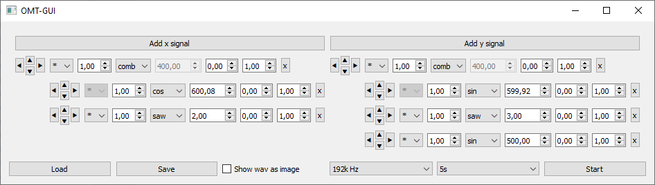
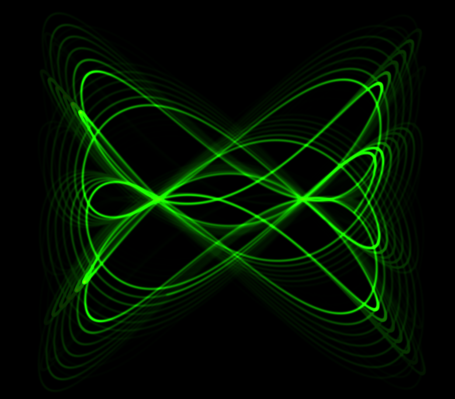

# Oscilloscope-Music-Toolbox
Tools to create oscilloscope music with python

To visualize a generated audio file you can use a software oscilloscope like https://oscilloscopemusic.com/osci.php

WIP

Update 28.05.2020: project on hold
Update 21.11.2021: main project still on hold, omt_gui wip

# OMT GUI

